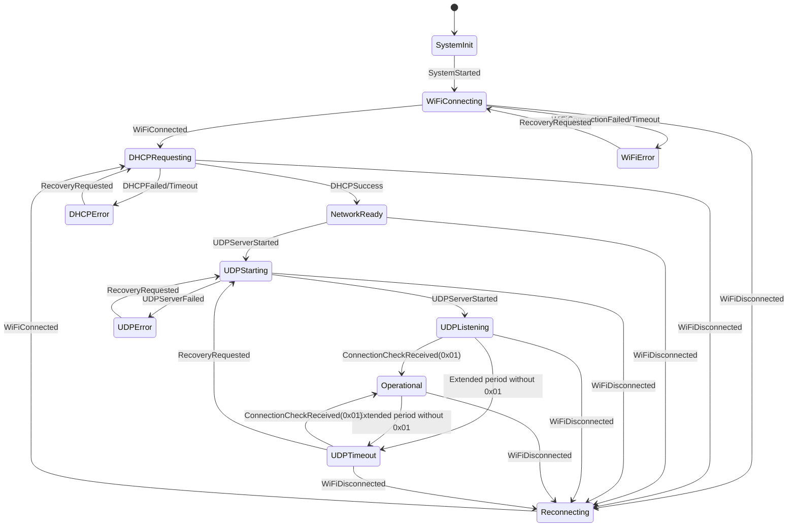

# ESP32 Firmware State Machine Design

## Overview

The ESP32 firmware state machine design incorporates the following key features:

1. **DHCP after WiFi connection** - Ensures proper network configuration
2. **UDP service startup after DHCP IP acquisition** - Guarantees services have correct network foundation
3. **0x01 message monitoring** - Long periods without receiving indicates UDP service anomaly
4. **DHCP reset on WiFi issues** - Ensures network state consistency
5. **mDNS waits for DHCP completion** - Ensures correct IP address availability

## State Machine States

### Core States (13 total)

```
Initialization State:
- SystemInit

Network Connection States:
- WiFiConnecting
- DHCPRequesting  
- NetworkReady

UDP Service States:
- UDPStarting
- UDPListening

Operational States:
- Operational
- UDPTimeout

Error States:
- WiFiError
- DHCPError
- UDPError

Recovery State:
- Reconnecting
```

## Key Processes

### Normal Startup Flow

```
SystemInit → WiFiConnecting → DHCPRequesting → NetworkReady → 
UDPStarting → UDPListening (start mDNS) → Operational
```

### Key Design Points

1. **Immediate DHCP after WiFi connection**
   - Directly enter DHCPRequesting state after successful WiFi connection

2. **UDP startup after DHCP completion**
   - Enter NetworkReady state after obtaining IP address
   - Immediately start UDP server

3. **0x01 message monitoring**
   - UDPListening state waits for first 0x01 message
   - Operational state continuously monitors 0x01 messages
   - Enter UDPTimeout state if not received for extended period

4. **DHCP reset on WiFi disconnection**
   - WiFi disconnection from any state enters Reconnecting
   - After successful reconnection, directly enter DHCPRequesting (re-acquire IP)

5. **mDNS depends on DHCP and UDP**
   - mDNS service starts in UDPListening state
   - Ensures UDP service is ready and has correct IP address

## State Machine Events

### Core Events (10 total)

- SystemStarted
- WiFiConnected / WiFiDisconnected
- DHCPSuccess / DHCPFailed
- UDPServerStarted / UDPServerFailed
- ConnectionCheckReceived (0x01 message)
- UDPTimeout
- LEDDataReceived
- WiFiConnectionFailed / RecoveryRequested / StateTimeout

## State Transition Diagram



## mDNS Service Handling

### mDNS Startup Timing

- **State**: `UDPListening`
- **Conditions**: UDP server started and listening, DHCP has acquired correct IP address
- **Purpose**: Allow desktop applications to discover ESP32 device

### mDNS Implementation Approach

Recommended **Approach A**: mDNS library-based implementation

- Remove manually implemented `mdns_broadcast_task`
- Retain `MdnsManager` calls in state machine
- Start mDNS service in UDPListening state

### mDNS Error Handling

- mDNS startup failure does not affect core functionality
- UDP service and LED data processing continue to work normally
- Desktop applications need to manually input IP address instead of automatic discovery

## Design Advantages

1. **Reasonable state count** - 13 states cover all key scenarios
2. **Streamlined events** - 10 core events with clear logic
3. **Clear responsibilities** - Each state has single, well-defined responsibility
4. **Intuitive flow** - Matches actual network connection process
5. **Comprehensive error handling** - Focus on critical error scenarios
6. **Good maintainability** - Code is easy to understand and modify

This state machine design aligns with real-world ESP32 network application scenarios, provides clear logic, and maintains all key functionality including complete mDNS device discovery support.

## Current Implementation Status

### Verified Features

- ✅ WiFi connection and DHCP acquisition
- ✅ UDP server startup and packet handling
- ✅ mDNS service discovery
- ✅ LED data processing and RMT transmission
- ✅ Connection monitoring via 0x01 messages
- ✅ State transitions and event handling
- ✅ Error recovery mechanisms

### Network Configuration

- **IP Address**: Dynamically assigned via DHCP
- **UDP Port**: 23042
- **mDNS Service**: `_atmosphere_light._udp.local.`
- **Device Hostname**: `board-rs.local.`

### Protocol Support

- **0x01**: Connection check messages
- **0x02**: LED data packets with offset-based transmission
- **0x03/0x04**: Ignored packets (as per protocol specification)

The state machine successfully manages the complete lifecycle from system initialization to operational LED control, providing robust network connectivity and service discovery capabilities.
